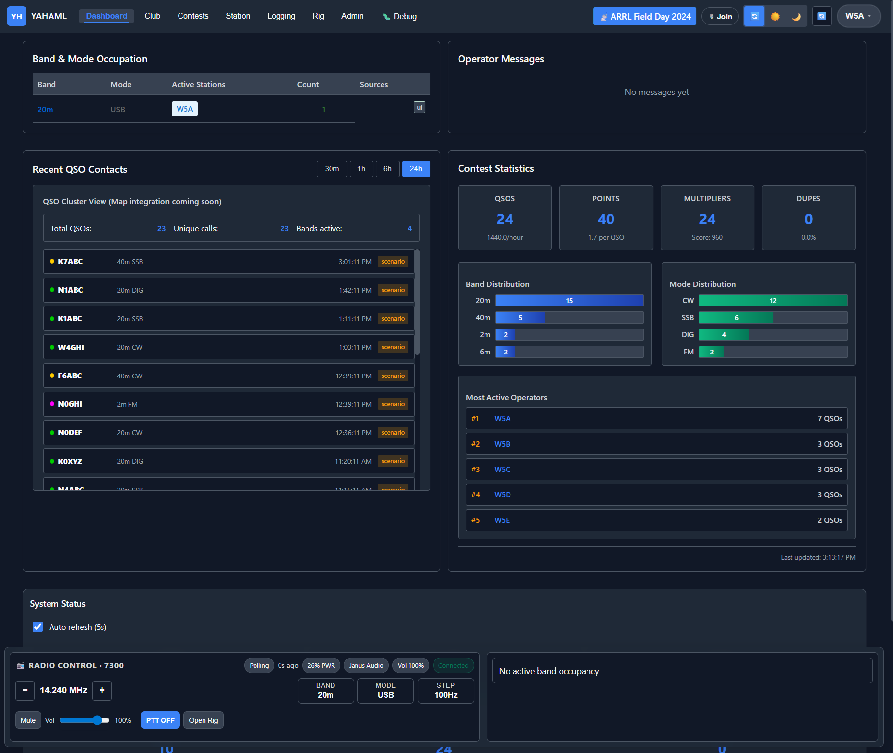
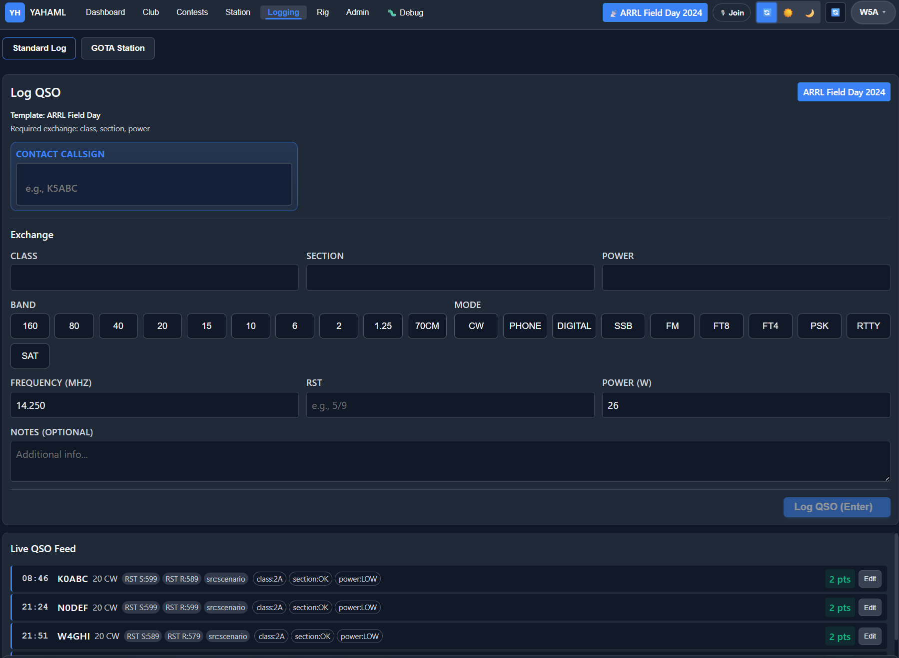
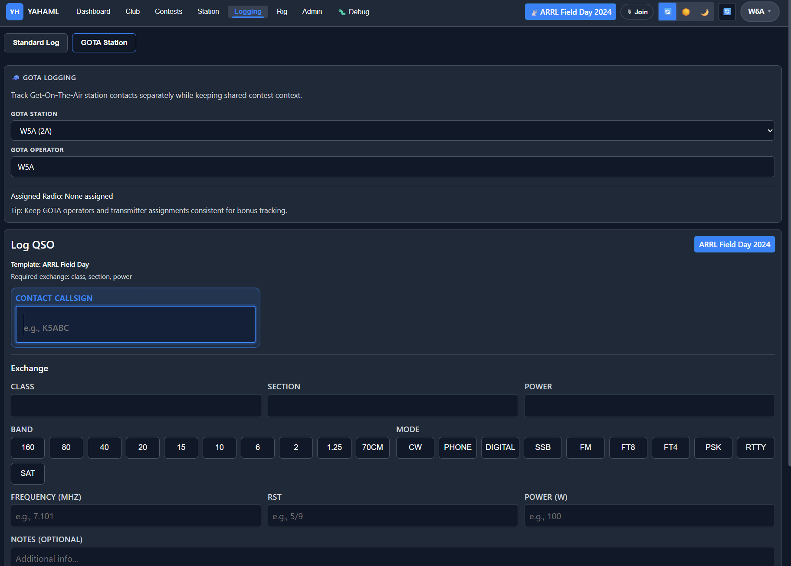
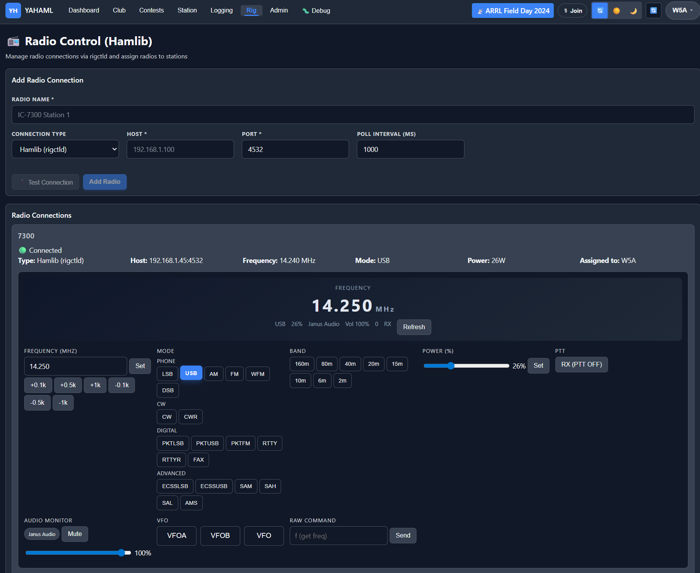
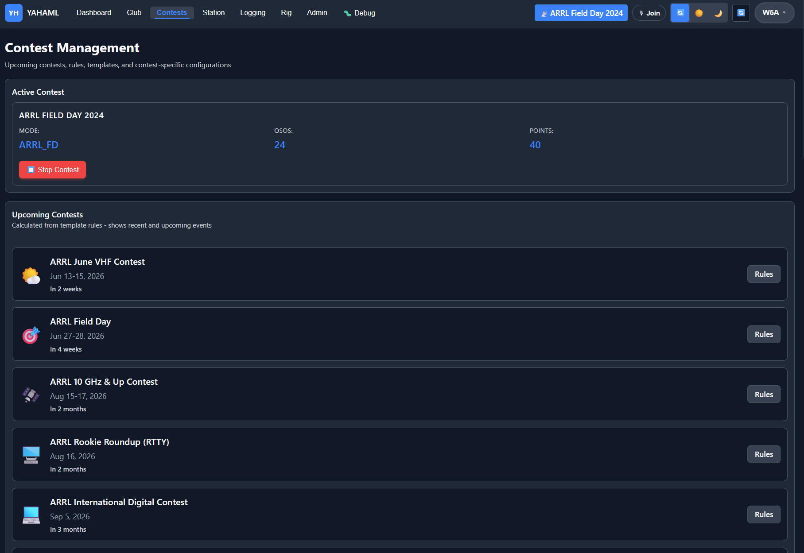
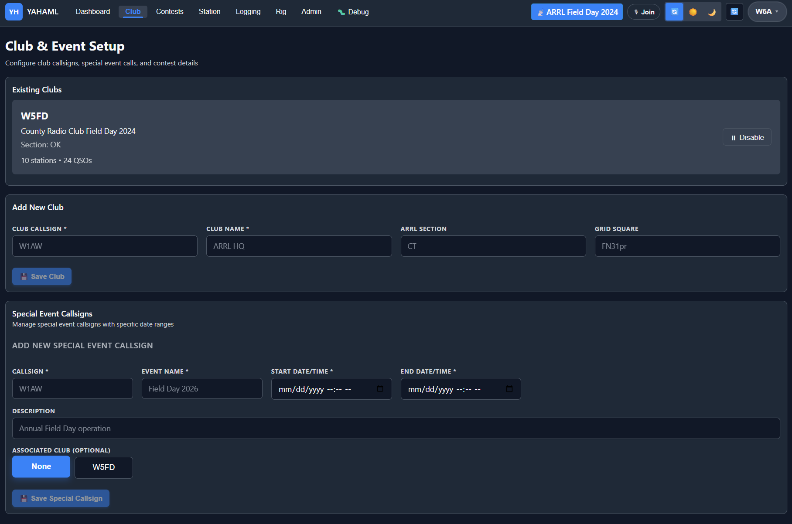

# Yet Another Ham Logger (YAHAML)

> Collaborative, field-ready ham radio logging platform for clubs, contest teams, and multi-operator stations.

YAHAML combines **modern web logging**, **live rig/audio control**, and a major interoperability bridge:

## 🚀 Why this is a big deal

### N3FJP compatibility layer (proxy + server-style ingest)

YAHAML can act as a practical interoperability bridge for N3FJP ecosystems:

- **Protocol-aware ingest paths** for external logging clients
- **TCP relay + UDP workflows** for station/band activity updates
- **Server-replacement style architecture** for teams that want centralized web logging and control
- **Real-time shared state** across operators (instead of isolated desktops)

If your ops workflow depends on N3FJP-compatible behavior, this is one of YAHAML’s biggest strategic advantages.

## 📸 Product screenshots

### Dashboard



### Logging workspace



### GOTA logging mode



### Rig control



### Contest management



### Club operations



## ✅ Core capabilities

### Real-time collaborative logging

- Multi-operator QSO logging with shared activity state
- Live QSO feed and station context updates over WebSocket
- Callsign sessions with restore behavior for smoother ops continuity
- Rich QSO fields: band, mode, frequency, power, RST, exchange, notes

### Contest-first workflow

- Built-in contest templates and validation rules
- Exchange enforcement and contest-aware UI behavior
- Band/mode occupancy publishing for team deconfliction
- ADIF/Cabrillo export support for downstream workflows

### Rig + audio operations

- HAMLib (`rigctld`) rig control integration
- Mode/frequency/PTT coordination in the UI
- Radio audio pipelines: loopback, HTTP stream, or Janus
- Voice-room signaling with WebRTC support for operator coordination

### Club + event operations

- Club callsign and special-event station support
- GOTA-friendly split workflows
- Multi-station operations with centralized control plane

## ⚙️ Quick start (local)

```bash
npm install
npm run db:generate
npm run db:push
npm run db:seed
npm run dev:all
```

- UI: http://localhost:5173
- API: http://localhost:3000

## 🐳 Docker deployment

### Option A: SQLite (file-backed)

```bash
docker compose up -d --build
```

- UI: http://localhost:8080
- API: http://localhost:3000
- SQLite data: `./data/yahaml.db`

### Option B: Postgres

```bash
docker compose -f docker-compose.postgres.yml up -d --build
```

> Note: Postgres requires Prisma datasource provider `postgresql` in `prisma/schema.prisma`.

## 🧰 Proxmox helper

```bash
sudo bash scripts/proxmox-deploy.sh
```

Set `COMPOSE_FILE=docker-compose.postgres.yml` if you want Postgres deployment.

## 📤 Log export (current capabilities)

YAHAML currently supports export via backend endpoints (contest-scoped):

- `GET /api/export/adif?contestId=<contestId>&format=3`
	- ADIF output (`.adi`)
	- `format=2` or `format=3`
- `GET /api/export/cabrillo?contestId=<contestId>&stationId=<stationId>&location=<optional>`
	- Cabrillo output (`.log`)
- `GET /api/export/reverse-log?contestId=<contestId>&remote_call=<CALL>&stationId=<stationId>`
	- Reverse-log output for a specific worked station

Important notes:

- Export is currently **contest-specific** (`contestId` required).
- UI export controls are not yet surfaced as first-class workflow buttons.
- Duplicate-merged records (`merge_status = duplicate_of`) are excluded from export.

### Practical workflow right now

1. Open active contest in UI (to identify the contest/station IDs you need).
2. Use the export endpoints above.
3. Import submission files into your destination system (LoTW/eQSL/contest robot).

Planned UX enhancement: add one-click export actions directly in Logging/Admin views.

## 📚 Documentation

Start with [docs/INDEX.md](docs/INDEX.md), then see:

- [Architecture](docs/architecture.md)
- [Deployment readiness](docs/DEPLOYMENT_READINESS.md)
- [Testing](docs/testing.md)
- [Janus setup](docs/janus-setup.md)
- [Radio audio sources](docs/radio-audio-sources.md)
- [N3FJP protocol summary](docs/protocol-summary.md)
- [N3FJP protocol debugging](docs/n3fjp_protocol_debugging.md)

## 🧪 Project status

YAHAML is under active development. For current progress and milestones, see [STATUS.md](STATUS.md).

## 🤝 Contributing

See [CONTRIBUTING.md](CONTRIBUTING.md).
